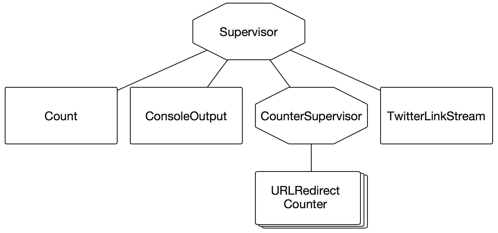

# Elixir and OTP

## Chris McGrath

### @chrismcg
### chris@chrismcg.com

---

# What is Elixir?

---

# Elixir

> Elixir is a dynamic, functional language designed for building scalable and maintainable applications.
> Elixir leverages the Erlang VM, known for running low-latency, distributed and fault-tolerant systems, while also being successfully used in web development and the embedded software domain.
-- http://www.elixir-lang.org

---

# What Elixir is NOT

* Some sort of CoffeeScript for Erlang
* A port of Ruby to Erlang
* Just Erlang with nicer syntax

---

# Some example code

```elixir
defmodule RedirectCounter.URL do
  @max_redirects 10

  def count_redirects(url) do
    { :ok, response } = HTTPoison.head(url)
    do_count(response.status_code, response.headers["Location"], 0)
  end

  defp do_count(_status_code, _url, @max_redirects), do: raise "To many redirects"

  defp do_count(status_code, url, redirect_count) when status_code in [301, 302, 307] do
    { :ok, response } = HTTPoison.head(url)
    do_count(response.status_code, response.headers["Location"], redirect_count + 1)
  end

  defp do_count(_status_code, _url, redirect_count), do: redirect_count
end

```

---

# Why learn Elixir?

---

# Personal Reasons

---

# "Boss" Reasons

* Our systems are becoming more and more parallel and the primitives provided by most languages are quite low level
* Runs on top of the Erlang runtime, famous for amazing uptimes and fault tolerance
* Powerful macro system for creating DSLs and reducing boilerplate
* OTP library and architecture makes it easier to create fault tolerant systems

---

# What's Elixir useful for?

* Network related tasks (from plain sockets to web servers and frameworks)
* Writing reliable, distributed, and highly available software
* MMO backends (not frontends!)
* Using *all* the cores
* (AKA Things Erlang Is Good For)

---

# What Elixir adds to Erlang

* Modules for namespacing
* Macros
* A focus on tooling
* Streaming

---

# What Elixir adds to Erlang

* Much nicer string handling
* Consistent function parameters
* Clearer organization of standard library
* Variable rebinding
* Less fiddly syntax

---

# Language Highlights

* Mix project management tool
* First class documentation and doctests
* Toll free calling of Erlang functions
* Macros
* Pipeline Operator
* Protocols

---

# Mix

* Generates and manages projects
* Somewhat similar to leiningen
* Like Make/Rake it can compile and runs tests
* Like Bundler it allows dependencies to be specified
* Like Rails or Bundler it can generate new project skeletons
* Full integration with Erlang, Rebar, and hex.pm

---

# IEx - Interactive Elixir REPL

```elixir
% iex
iex(1)> x = 1 + 2
3
iex(2)> x = 4
4
iex(3)> IO.puts "Hello World"
Hello World
:ok
```

---

# Documentation & Doctests

```elixir
defmodule ShowDoctest do
  @moduledoc """
  This module shows off an example of a doctest
  """

  @doc """
  Adds it's inputs together

  iex> ShowDoctest.add(1, 1)
  2
  """
  def add(a, b) do
    a - b
  end
end
```

---

```elixir
defmodule ShowDoctestTest do
  use ExUnit.Case, async: true
  doctest ShowDoctest
end
```

```elixir
% mix test

1) test doc at ShowDoctest.add/2 (1) (ShowDoctestTest)
   test/show_doctest_test.exs:3
   Doctest failed
   code: ShowDoctest.add(1, 1) === 2
   lhs:  0
   stacktrace:
   lib/show_doctest.ex:12: ShowDoctest (module)
```

---

# IEx Doc integration

```
% iex -S mix
iex(1)> h ShowDoctest

                                  ShowDoctest

This module shows off an example of a doctest

iex(2)> h ShowDoctest.add

                                 def add(a, b)

Adds it's inputs together
```

---

# Toll free calling into erlang

You can use any available Erlang library in your Elixir project

```erlang
% erl
Eshell V6.3  (abort with ^G)
1> os:timestamp().
{1422,119363,162867}
```

```elixir
% iex
iex(1)> :os.timestamp
{1422, 119376, 391592}
```

---

# Macros


> Lisps traditionally empowered developers because you can eliminate anything that's tedious through macros, and that power is really what people keep going back for
-- Rich Hickey

---

# Macro Example

```elixir
test "some sums" do
  assert 1 + 1 == 3
end
```

```elixir
1) test some math (TestProjectTest)
   ** (ExUnit.ExpectationError)
   expected: 2
   to be equal to (==): 3
   at test/test_project_test.exs:5
```
---

# Macro Example

```elixir
iex(1)> quote do: 1 + 1 == 3
{:==, [context: Elixir, import: Kernel],
 [{:+, [context: Elixir, import: Kernel], [1, 1]}, 3]}

defmacro assert({ :==, _, [l, r]}) do
  # ...
end

defmacro assert({ :=~, _, [l, r]}) do
  # ...
end

```

---

# Pipelines

```elixir
people = DB.find_customers
orders = Orders.for_customers(people)
tax    = sales_tax(orders, 2013)
filing = prepare_filing(tax)
```

---

# Pipelines

```elixir
filing = DB.find_customers
         |> Orders.for_customers
         |> sales_tax(2013)
         |> prepare_filing
```

---

# Pipelines

```elixir
# rewritten to...
filing = prepare_filing(
            sales_tax(
              Orders.for_customers(DB.find_customers),
              2013
            ))
```

---

# Protocols

* Let you have polymorphism in Elixir
* Inspired heavily by Clojure
* Can define implementation of built in protocols for your own types

---

# Protocols: Definition[^1]

```
defprotocol Blank do
  @doc "Returns true if data is considered blank/empty"
  def blank?(data)
end
```

[^1]: Sorry, the syntax highlighter doesn't know about protocols yet

---

# Protocols: Implementation[^1]

```
# Integers are never blank
defimpl Blank, for: Integer do
  def blank?(_), do: false
end

# Just empty list is blank
defimpl Blank, for: List do
  def blank?([]), do: true
  def blank?(_),  do: false
end

#...
```

---

# Protocols: Calling

```elixir
iex> Blank.blank?(0)
false
iex> Blank.blank?([])
true
iex> Blank.blank?([1, 2, 3])
false
```

---

# Enumerable

```elixir
iex(1)> Enum.map([1, 2, 3], fn(x) -> x * x end)
[1, 4, 9]
iex(2)> Enum.map([1, 2, 3], &(&1 * &1))
[1, 4, 9]
```

---

# Enumerable

```elixir
iex(1)> stream = Stream.map([1, 2, 3], &(&1 * &1))
#Stream<[enum: [1, 2, 3], funs: [#Function<45.29647706/1 in Stream.map/2>]]>
iex(2)> stream = Stream.map(stream, &Integer.to_string/1)
#Stream<[enum: [1, 2, 3],
 funs: [#Function<45.29647706/1 in Stream.map/2>,
   #Function<45.29647706/1 in Stream.map/2>]]>
iex(3)> Enum.to_list(stream)
["1", "4", "9"]
```

---


```elixir
# More example code
defmodule RedirectCounter.Twitter do
  def configure do
    # ... boring setup ...
  end

  def links do
    configure
    ExTwitter.stream_filter(track: "link")
    |> Stream.reject(fn(t) -> t.entities["urls"] == [] end)
    |> Stream.flat_map(fn(t) ->
      Enum.map(t.entities["urls"], fn(u) -> u["expanded_url"] end)
    end)
  end
end
```

---

# OTP

---

# OTP[^2]

* Large collection of libraries covering a wide range of use cases
* Set of design principles encoded in behaviours

[^2]: Open Telephony Platform - A marketing idea gone bad

---

# Behaviours

* Specify callbacks that you implement to specialize your own code
* Formalize common patterns
* Can create your own
* Four standard ones in Erlang

---

# OTP GenServer

---

```elixir
defmodule RedirectCounter.TwitterLinkStream do
  use GenServer

  def start_link do
    GenServer.start_link __MODULE__, [], name: __MODULE__
  end

  def init(_) do
    GenServer.cast __MODULE__, :stream
    { :ok, nil }
  end

  def handle_cast(:stream, state) do
    spawn_link fn ->
      RedirectCounter.Twitter.links
      |> Enum.each(&RedirectCounter.CounterSupervisor.process/1)
    end
    { :noreply, state }
  end
end
```

---

```elixir
defmodule RedirectCounter.Count do
  use GenServer

  def start_link do
    GenServer.start_link __MODULE__, [], name: __MODULE__
  end

  def log(redirect_count) do
    GenServer.cast __MODULE__, { :redirect_count, redirect_count }
  end

  def get do
    GenServer.call __MODULE__, :get
  end

  def init(_) do
    { :ok, %{} }
  end

  def handle_cast({:redirect_count, redirect_count}, state) do
    state = Map.update(state, redirect_count, 1, fn(n) -> n + 1 end)
    { :noreply, state }
  end

  def handle_call(:get, _from, state) do
    { :reply, state, state }
  end
end
```

---

```elixir
def start_link do
  GenServer.start_link __MODULE__, [], name: __MODULE__
end

def log(redirect_count) do
  GenServer.cast __MODULE__, { :redirect_count, redirect_count }
end

def get do
  GenServer.call __MODULE__, :get
end
```

---

```elixir
def init(_) do
  { :ok, %{} }
end

def handle_cast({:redirect_count, redirect_count}, state) do
  state = Map.update(state, redirect_count, 1, fn(n) -> n + 1 end)
  { :noreply, state }
end

def handle_call(:get, _from, state) do
  { :reply, state, state }
end
```

---

```elixir
iex(1)> alias RedirectCounter.Count
nil
iex(2)> Count.start_link
{:ok, #PID<0.91.0>}
iex(3)> Count.log(1)
:ok
iex(4)> Count.log(1)
:ok
iex(5)> Count.log(1)
:ok
iex(6)> Count.log(2)
:ok
iex(7)> Count.log(3)
:ok
iex(8)> Count.get
%{1 => 3, 2 => 1, 3 => 1}
```

---

# Call vs Cast

---

# Cast

* Asynchronous
* fire & forget
* More decoupled
* Less control over when things happen

---

# Call

* Synchronous
* More coupled
* More control over order of events

---

# OTP Supervisors

---

# Supervisors

* Don't do any processing
* Start and restart workers and other supervisors
* Prevent errors taking the entire application down
* Shutdown system in a controlled manor

---

# Supervision Trees



---

```elixir
defmodule RedirectCounter.Supervisor do
  use Supervisor

  def start_link do
    Supervisor.start_link(__MODULE__, [])
  end

  def init(_) do
    children = [
      worker(RedirectCounter.Count, []),
      worker(RedirectCounter.ConsoleOutput, []),
      supervisor(RedirectCounter.CounterSupervisor, []),
      worker(RedirectCounter.TwitterLinkStream, [])
    ]

    supervise(children, strategy: :one_for_one)
  end
end
```

---

```elixir
defmodule RedirectCounter.CounterSupervisor do
  use Supervisor

  def start_link do
    Supervisor.start_link __MODULE__, [], name: __MODULE__
  end

  def process(url) do
    {:ok, pid} = Supervisor.start_child(__MODULE__, [url])
    GenServer.cast(pid, :count)
  end

  def init(_) do
    children = [
      worker(RedirectCounter.URLRedirectCounter, [],
             restart: :temporary, shutdown: :brutal_kill)
    ]
    supervise(children, strategy: :simple_one_for_one)
  end
end
```

---


```elixir
defmodule RedirectCounter.URLRedirectCounter do
  use GenServer

  def start_link(url) do
    GenServer.start_link(__MODULE__, url)
  end

  def init(url) do
    { :ok, url }
  end

  def handle_cast(:count, url) do
    redirect_count = RedirectCounter.URL.count_redirects(url)
    RedirectCounter.Count.log(redirect_count)
    { :stop, :normal, url }
  end
end
```

---

# Supervision Strategies

* `one_for_one`
* `simple_one_for_one`
* `rest_for_one`
* `one_for_all`

---

# Restart options

* `permanent`
* `temporary`
* `transient`

---

# Error Kernel

>  Good Erlang design begins with identifying the error kernel of the system: What part must not fail or it will bring down the whole system?
-- [Jesper Louis Anderson](http://jlouisramblings.blogspot.co.uk/2010/11/on-erlang-state-and-crashes.html)

---

# Error Kernel

> Whenever the kernel is about to do an operation which is dangerous and might crash, you "outsource" that computation to another process, a dumb slave worker. If he crashes and is killed, nothing really bad has happened - since the kernel keeps going.
-- [Jesper Louis Anderson](http://jlouisramblings.blogspot.co.uk/2010/11/on-erlang-state-and-crashes.html)

---

# Agent

---


```elixir
# Plain GenServer
defmodule RedirectCounter.Count do
  use GenServer

  def start_link do
    GenServer.start_link __MODULE__, [], name: __MODULE__
  end

  def log(redirect_count) do
    GenServer.cast __MODULE__, { :redirect_count, redirect_count }
  end

  def get do
    GenServer.call __MODULE__, :get
  end

  def init(_) do
    { :ok, %{} }
  end

  def handle_cast({:redirect_count, redirect_count}, state) do
    state = Map.update(state, redirect_count, 1, fn(n) -> n + 1 end)
    { :noreply, state }
  end

  def handle_call(:get, _from, state) do
    { :reply, state, state }
  end
end
```

---


```elixir
# Elixir Agent
defmodule RedirectCounter.Count do
  def start_link do
    Agent.start_link(fn -> %{} end, name: __MODULE__)
  end

  def log(redirect_count) do
    Agent.update(__MODULE__,
      &Map.update(&1, redirect_count, 1, fn(n) -> n + 1 end))
  end

  def get do
    Agent.get(__MODULE__, fn(map) -> map end)
  end
end
```

---

# Task and Task.Supervisor

---

# Simple Example

```elixir
task = Task.async(fn -> do_some_work() end)
res  = do_some_other_work()
res + Task.await(task)
```

---


```elixir
# Main Supervisor - Before
defmodule RedirectCounter.Supervisor do
  use Supervisor

  def start_link do
    Supervisor.start_link(__MODULE__, [])
  end

  def init(_) do
    children = [
      worker(RedirectCounter.Count, []),
      worker(RedirectCounter.ConsoleOutput, []),
      supervisor(RedirectCounter.CounterSupervisor, []),
      worker(RedirectCounter.TwitterLinkStream, [])
    ]

    supervise(children, strategy: :one_for_one)
  end
end
```
---


```elixir
# Main Supervisor - After
defmodule RedirectCounter.Supervisor do
  use Supervisor

  def start_link do
    Supervisor.start_link(__MODULE__, [])
  end

  def init(_) do
    children = [
      worker(RedirectCounter.Count, []),
      worker(RedirectCounter.ConsoleOutput, []),
      supervisor(Task.Supervisor, [[name: :counter_supervisor]]),
      worker(Task, [RedirectCounter.Twitter, :process, [&RedirectCounter.URL.process/1]])
    ]

    supervise(children, strategy: :one_for_one)
  end
end
```

---


```elixir
# Previous RedirectCounter.Twitter
defmodule RedirectCounter.Twitter do
  def configure do
    # ... boring setup ...
  end

  def links do
    configure
    ExTwitter.stream_filter(track: "link")
    |> Stream.reject(fn(t) -> t.entities["urls"] == [] end)
    |> Stream.flat_map(fn(t) ->
      Enum.map(t.entities["urls"], fn(u) -> u["expanded_url"] end)
    end)
  end
end
```

---

```elixir
# Updated RedirectCounter.Twitter
defmodule RedirectCounter.Twitter do
  def process(fun) do
    links |> Enum.each(fun)
  end

  # ...
end
```

---


```elixir
# Previous RedirectCounter.URL
defmodule RedirectCounter.URL do
  @max_redirects 10

  def count_redirects(url) do
    { :ok, response } = HTTPoison.head(url)
    do_count(response.status_code, response.headers["Location"], 0)
  end

  defp do_count(_status_code, _url, @max_redirects), do: raise "To many redirects"
  defp do_count(status_code, url, redirect_count) when status_code in [301, 302, 307] do
    { :ok, response } = HTTPoison.head(url)
    do_count(response.status_code, response.headers["Location"], redirect_count + 1)
  end
  defp do_count(_status_code, _url, redirect_count) do
    redirect_count
  end
end
```

---


```elixir
# Updated RedirectCounter.URL
defmodule RedirectCounter.URL do
  def process(url) do
    Task.Supervisor.start_child(:counter_supervisor, __MODULE__, :count_redirects, [url])
  end

  def count_redirects(url) do
    { :ok, response } = HTTPoison.head(url)
    redirect_count = do_count(response.status_code, response.headers["Location"], 0)
    RedirectCounter.Count.log(redirect_count)
  end
  # ...
end
```

---

# What I haven't covered

* `gen_event` and `gen_fsm`
* Applications (in Erlang terminology)
* Upgrades and hot code reloading
* Debugging, monitoring, and logging
* The other parts of OTP (ssh, asn.1, ...)
* ets / mnesia (built in "NoSQL" databases)

---

# Interesting Elixir projects

* **Plug**: Rack/WSGI like layer for Elixir
* **Phoenix**: Batteries included web/websockets framework
* **Ewebmachine**: Generates HTTP responses based on HTTP decision tree
* **Ecto**: LINQ inspired database abstraction layer

---

# ElixirConf.eu

## 23rd - 24th April 2015
## Krakow, Poland
## http://www.elixirconf.eu

---

# Thanks!

I hope I've interested you in Elixir and Erlang/OTP


* http://elixir-lang.org
* Progamming Elixir - Pragmatic Programmers
* Elixir in Action - Manning
* Erlang and OTP in Action - Manning
* http://www.erlang-in-anger.com/

